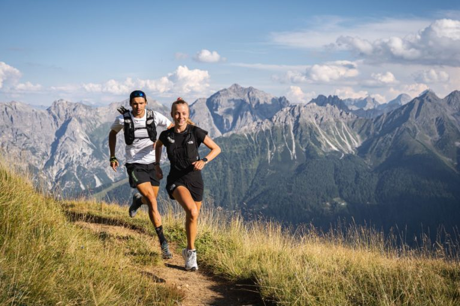

## Step 1: Ask - Define the business tasks

### 1.1. Business Task

Analyzing smart device usage data (FitBit fitness tracker data) to gain insight into how consumers use their devices, identify new trends, and then apply these insights to Bellabeat products, provide high-level recommendations for a marketing strategy that will help unlock new growth opportunities for the company.

## Step 2: Prepare - Collect and load data

### 2.1. Install and load essential packages

```{r}
library(tidyverse) # For data manipulation and plotting (includes ggplot2, dplyr)
library(janitor) # For cleaning column names
library(lubridate) # For working with dates and times
```

### 2.2. Load data

For this project, I used FitBit fitness tracker [data](https://www.kaggle.com/datasets/arashnic/fitbit).

```{r}
daily_activity <- read_csv("data/dailyActivity_merged.csv")
hourly_calories <- read_csv("data/hourlyCalories_merged.csv")
hourly_intensities <- read_csv("data/hourlyIntensities_merged.csv")
hourly_steps <- read_csv("data/hourlySteps_merged.csv")
minute_calories <- read_csv("data/minuteCaloriesNarrow_merged.csv")
minute_intensities <- read_csv("data/minuteIntensitiesNarrow_merged.csv")
minute_steps <- read_csv("data/minuteStepsNarrow_merged.csv")
minutes_mets <- read_csv("data/minuteMETsNarrow_merged.csv")
minute_sleep <- read_csv("data/minuteSleep_merged.csv")
heartrate_seconds <- read_csv("data/heartrate_seconds_merged.csv")
weight_log <- read_csv("data/weightLogInfo_merged.csv")
```

## Step 3: Process - Wrangle data and clean

### 3.1. Initial inspection

Get a quick overview of each dataset using functions like `head()`, `str()`, and `summary()`. This will help us understand the structure, data types, and identify any initial issues.

```{r}
head(hourly_calories)
str(hourly_calories)
summary(hourly_calories)
```

### 3.2. Clean and Format

#### 3.2.1. Clean column names

Use `clean_names()` to make all column names consistent (e.g., "Id" -\> "id")

```{r}
hourly_calories <- clean_names(hourly_calories)
hourly_intensities <- clean_names(hourly_intensities)
hourly_steps <- clean_names(hourly_steps)
minute_sleep <- clean_names(minute_sleep)
weight_log <- clean_names(weight_log)
```

#### 3.2.2. Format dates and times

Convert the character-string dates into the format R understands

```{r}
hourly_calories$activity_hour <- mdy_hms(hourly_calories$activity_hour)
hourly_intensities$activity_hour <- mdy_hms(hourly_intensities$activity_hour)
hourly_steps$activity_hour <- mdy_hms(hourly_steps$activity_hour)
minute_sleep$date <- mdy_hms(minute_sleep$date)
weight_log$date <- mdy_hms(weight_log$date)
```

#### 3.2.3. Check for duplicates

```{r}
sum(duplicated(hourly_calories))
sum(duplicated(hourly_intensities))
sum(duplicated(hourly_steps))
sum(duplicated(minute_sleep))
sum(duplicated(weight_log))
```

Since dataframe minute_sleep includes 525 duplicates, we will remove the duplicated ones by

```{r}
minute_sleep <- distinct(minute_sleep)
```

### 3.3. Merge the hourly data

Combine three hourly datasets into one

```{r}
hourly_activity <- merge(hourly_calories, hourly_intensities, by = c("id", "activity_hour"))
hourly_activity <- merge(hourly_activity, hourly_steps, by = c("id", "activity_hour"))
```

Check the new merged dataset

```{r}
print(names(hourly_activity))
```

### 3.4. Aggregates data to the "Daily" level

To get a comprehensive view, we will summarize data by day, not by hour or minute. 

#### 3.4.1. Create dataset daily_activity (steps, calories, intensities)

```{r}
daily_activity <- hourly_activity %>% 
  mutate(activity_date = as_date(activity_hour)) %>% # Create date column
  group_by(id, activity_date) %>% 
  summarise(
    total_steps = sum(step_total),
    total_calories = sum(calories),
    total_intensity = sum(total_intensity),
    avg_hourly_intensity = mean(average_intensity)
  )
```

```{r check the new dataset daily_activity}
head(daily_activity)

```

#### 3.4.2. Create dataset daily_sleep

```{r}
daily_sleep <- minute_sleep %>% 
  mutate(sleep_day = as_date(date)) %>% 
  group_by(id, sleep_day) %>% 
  summarize(total_minutes_asleep = sum(value)) # "value" is minutes asleep
```

#### 3.4.3. Merge daily datasets for a master view

Combine daily_activity and daily_sleep datasets

```{r}
daily_summary <- merge(daily_activity, daily_sleep, by.x = c("id", "activity_date"), by.y = c("id", "sleep_day"))
```

```{r}
head(daily_summary)
```

## Step 4: Analyze - Aggregate and Summarize

In this step, we use our clean data to explore trends and insights. 

### 4.1. Get high-level summary statistics 

Calculate summary statistics for key variables like steps, calories, sleep, and intensity. These give us a baseline understanding of user behaviors.

```{r}
summary(daily_summary$total_steps)
summary(daily_summary$total_calories)
summary(daily_summary$total_minutes_asleep)
summary(daily_summary$total_intensity)
```

Find out how many participants are in each dataset

```{r}
n_distinct(daily_summary$id) # Users with both activity and sleep
n_distinct(weight_log$id) # Users who logged their weight
```

### 4.2. Look for relationships/correlations

* How are steps related to calories?

```{r}
cor(daily_summary$total_steps, daily_summary$total_calories)
```

* How is sleep related to intensity?

```{r}
cor(daily_summary$total_minutes_asleep, daily_summary$total_intensity)
```

-   How is sleep related to steps?

```{r}
cor(daily_summary$total_minutes_asleep, daily_summary$total_steps)
```

### 4.3. Analyze hourly patterns

Answer the question when are users most active during the day?

```{r}
hourly_avg <- hourly_activity %>% 
  mutate(hour = hour(activity_hour)) %>% #Extract the hour
  group_by(hour) %>% 
  summarize(
    avg_steps = mean(step_total),
    avg_calories = mean(calories),
    avg_total_intensity = mean(total_intensity)
  )
```

Look at the hourly averages

```{r}
print(hourly_avg)
```

## Step 5: Share - Visualizing data

At this step, we create visualizations with **ggplot2** to tell our story.

### 5.1. Plot: Total steps vs. Calories burned

```{r}
ggplot(data=daily_summary, aes(x=total_steps, y=total_calories)) +
  geom_point(color = "darkgreen", alpha = 0.5) +
  geom_smooth(method = "lm", color = "navy") +
  labs(title = "Total steps vs. Calories burned",
       x = "Total steps per day",
       y = "Calories burned per day") +
  theme_light()
```

```{r save the plot}
ggsave("steps_vs_calories.png")
```

### 5.2. Plot: Total minutes asleep vs. Total daily intensity 

```{r}
ggplot(data = daily_summary, aes(x=total_minutes_asleep, y=total_intensity)) +
  geom_point(color = "navy", alpha = 0.5) +
  geom_smooth(color = "darkred") +
  labs(title = "Sleep vs. Total Daily Intensity",
       x = "Total minutes asleep",
       y = "Total daily intensity") +
  theme_light()
```

```{r}
ggsave("sleep_vs_intensity.png")
```

### 5.3. Plot: Average steps by hours

```{r}
ggplot(data= hourly_avg, aes(x=hour, y=avg_steps)) +
  geom_col(fill="darkgreen")+
  labs(title = "Average steps by hours of day",
       x= "Hours of day (0-23)",
       y= "Average steps") +
  theme_light()
```

```{r}
ggsave("hourly_activity.png")
```

## Step 6: Act - Formulate recommendations

### 6.1. Summarizing insights

-   **Insight #1 - Users are moderately active**: Based on the `summary(daily_summary$total_steps)` command, the average user takes around 7,605 steps per day. While active, this is below the commonly cited 10,000-step goal, suggesting there is an opportunity to encourage users to be more active.

-   **Insight #2 - Activity peaks outside work hours**: The hourly activity plot `(ggplot(data = hourly_avg, aes(x = hour, y = avg_steps)))` is the most powerful insight. It clearly shows that user activity is low during the typical 9 AM - 5 PM workday and has distinct peaks: one around 12 PM and one in the evening 5 PM - 7 PM.

-   **Insight #3 - Users prefer automatic tracking**: The `n_distinct(weight_log$id)` command shows that only a very small fraction of users in this dataset (likely 11 out of 33) ever logged their weight. This strongly implies that users dislike or forget to perform manual data entry.

-   **Insight #4 - Sleep and Intensity have a weak relationship**: The correlation between `total_minutes_asleep` and `total_intensity` is likely weak (-0.08873266). This finding suggests that simply sleeping more doesn't automatically mean a user will be more active (or vice versa). Therefore, marketing should probably treat sleep and activity as separate (but related) wellness goals.

### 6.2. Recommendations for Bellabeat


Here are three high-level recommendations for Bellabeat's marketing strategy, based directly on the insights above. We could apply these to a Bellabeat products like the **Leaf** or **Time**.

1.  **Market "Workday Wellness" reminders** (based on Insight #2 - Users are least active during the 9 AM - 5 PM workday).

    **Recommendation**: Bellabeat should create a marketing campaign for the Leaf/Time that focuses on its "inactivity alert" or "mindful moment" features. The Bellabeat app could send push notifications (e.g., at 11 AM and 3 PM) to remind users to take a short walk or stretch. This positions the product as a wellness companion that helps user stay healthy during the workday, not just at the gym.

2.  **Launch an "Evening Activity" campaign** (based on Insight #2 - The largest activity peak occurs between 5 PM and 7 PM).

    **Recommendation**: This is the golden hour for engagement. Bellabeat's marketing should target users at this time.

      * App Marketing: Send push notifications around 4:30 PM with messages like, "Your workday is ending! Get your steps in." or "Join our Bellabeat community challenge at 6 PM."

      * Social Media: Run ads during this window that encourage an evening walk or workout. This leverages a habit users already have.

3.  **Emphasize "Effortless Tracking" in all marketing** (based on Insight #3 - Users do not log data manually).

    **Recommendation**: Bellabeat's marketing should heavily emphasize that its products (Leaf, Time) track activity, sleep, and stress automatically. Use words like "effortless," "automatic," and "set it and forget it." This is a key competitive advantage against apps that require manual logging and directly addresses the user behavior seen in the data. They should de-emphasize features that require a lot of manual input.
