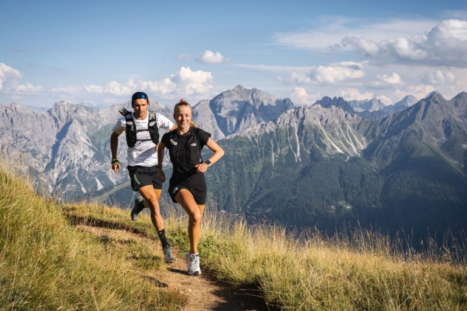

Bellabeat_RMarkdown
================
Giang Nguyen
2025-10-22

## Step 1: Ask - Define the business tasks

### 1.1. Business Task

Analyzing smart device usage data (FitBit fitness tracker data) to gain
insight into how consumers use their devices, identify new trends, and
then apply these insights to Bellabeat products, provide high-level
recommendations for a marketing strategy that will help unlock new
growth opportunities for the company.

## Step 2: Prepare - Collect and load data

### 2.1. Install and load essential packages

``` r
library(tidyverse) # For data manipulation and plotting (includes ggplot2, dplyr)
```

    ## ── Attaching core tidyverse packages ──────────────────────── tidyverse 2.0.0 ──
    ## ✔ dplyr     1.1.4     ✔ readr     2.1.5
    ## ✔ forcats   1.0.1     ✔ stringr   1.5.2
    ## ✔ ggplot2   4.0.0     ✔ tibble    3.3.0
    ## ✔ lubridate 1.9.4     ✔ tidyr     1.3.1
    ## ✔ purrr     1.1.0     
    ## ── Conflicts ────────────────────────────────────────── tidyverse_conflicts() ──
    ## ✖ dplyr::filter() masks stats::filter()
    ## ✖ dplyr::lag()    masks stats::lag()
    ## ℹ Use the conflicted package (<http://conflicted.r-lib.org/>) to force all conflicts to become errors

``` r
library(janitor) # For cleaning column names
```

    ## 
    ## Attaching package: 'janitor'
    ## 
    ## The following objects are masked from 'package:stats':
    ## 
    ##     chisq.test, fisher.test

``` r
library(lubridate) # For working with dates and times
```

### 2.2. Load data

For this project, I used FitBit fitness tracker
[data](https://www.kaggle.com/datasets/arashnic/fitbit).

``` r
daily_activity <- read_csv("data/dailyActivity_merged.csv")
```

    ## Rows: 457 Columns: 15
    ## ── Column specification ────────────────────────────────────────────────────────
    ## Delimiter: ","
    ## chr  (1): ActivityDate
    ## dbl (14): Id, TotalSteps, TotalDistance, TrackerDistance, LoggedActivitiesDi...
    ## 
    ## ℹ Use `spec()` to retrieve the full column specification for this data.
    ## ℹ Specify the column types or set `show_col_types = FALSE` to quiet this message.

``` r
hourly_calories <- read_csv("data/hourlyCalories_merged.csv")
```

    ## Rows: 24084 Columns: 3
    ## ── Column specification ────────────────────────────────────────────────────────
    ## Delimiter: ","
    ## chr (1): ActivityHour
    ## dbl (2): Id, Calories
    ## 
    ## ℹ Use `spec()` to retrieve the full column specification for this data.
    ## ℹ Specify the column types or set `show_col_types = FALSE` to quiet this message.

``` r
hourly_intensities <- read_csv("data/hourlyIntensities_merged.csv")
```

    ## Rows: 24084 Columns: 4
    ## ── Column specification ────────────────────────────────────────────────────────
    ## Delimiter: ","
    ## chr (1): ActivityHour
    ## dbl (3): Id, TotalIntensity, AverageIntensity
    ## 
    ## ℹ Use `spec()` to retrieve the full column specification for this data.
    ## ℹ Specify the column types or set `show_col_types = FALSE` to quiet this message.

``` r
hourly_steps <- read_csv("data/hourlySteps_merged.csv")
```

    ## Rows: 24084 Columns: 3
    ## ── Column specification ────────────────────────────────────────────────────────
    ## Delimiter: ","
    ## chr (1): ActivityHour
    ## dbl (2): Id, StepTotal
    ## 
    ## ℹ Use `spec()` to retrieve the full column specification for this data.
    ## ℹ Specify the column types or set `show_col_types = FALSE` to quiet this message.

``` r
minute_calories <- read_csv("data/minuteCaloriesNarrow_merged.csv")
```

    ## Rows: 1445040 Columns: 3
    ## ── Column specification ────────────────────────────────────────────────────────
    ## Delimiter: ","
    ## chr (1): ActivityMinute
    ## dbl (2): Id, Calories
    ## 
    ## ℹ Use `spec()` to retrieve the full column specification for this data.
    ## ℹ Specify the column types or set `show_col_types = FALSE` to quiet this message.

``` r
minute_intensities <- read_csv("data/minuteIntensitiesNarrow_merged.csv")
```

    ## Rows: 1445040 Columns: 3
    ## ── Column specification ────────────────────────────────────────────────────────
    ## Delimiter: ","
    ## chr (1): ActivityMinute
    ## dbl (2): Id, Intensity
    ## 
    ## ℹ Use `spec()` to retrieve the full column specification for this data.
    ## ℹ Specify the column types or set `show_col_types = FALSE` to quiet this message.

``` r
minute_steps <- read_csv("data/minuteStepsNarrow_merged.csv")
```

    ## Rows: 1445040 Columns: 3
    ## ── Column specification ────────────────────────────────────────────────────────
    ## Delimiter: ","
    ## chr (1): ActivityMinute
    ## dbl (2): Id, Steps
    ## 
    ## ℹ Use `spec()` to retrieve the full column specification for this data.
    ## ℹ Specify the column types or set `show_col_types = FALSE` to quiet this message.

``` r
minutes_mets <- read_csv("data/minuteMETsNarrow_merged.csv")
```

    ## Rows: 1445040 Columns: 3
    ## ── Column specification ────────────────────────────────────────────────────────
    ## Delimiter: ","
    ## chr (1): ActivityMinute
    ## dbl (2): Id, METs
    ## 
    ## ℹ Use `spec()` to retrieve the full column specification for this data.
    ## ℹ Specify the column types or set `show_col_types = FALSE` to quiet this message.

``` r
minute_sleep <- read_csv("data/minuteSleep_merged.csv")
```

    ## Rows: 198559 Columns: 4
    ## ── Column specification ────────────────────────────────────────────────────────
    ## Delimiter: ","
    ## chr (1): date
    ## dbl (3): Id, value, logId
    ## 
    ## ℹ Use `spec()` to retrieve the full column specification for this data.
    ## ℹ Specify the column types or set `show_col_types = FALSE` to quiet this message.

``` r
heartrate_seconds <- read_csv("data/heartrate_seconds_merged.csv")
```

    ## Rows: 1154681 Columns: 3
    ## ── Column specification ────────────────────────────────────────────────────────
    ## Delimiter: ","
    ## chr (1): Time
    ## dbl (2): Id, Value
    ## 
    ## ℹ Use `spec()` to retrieve the full column specification for this data.
    ## ℹ Specify the column types or set `show_col_types = FALSE` to quiet this message.

``` r
weight_log <- read_csv("data/weightLogInfo_merged.csv")
```

    ## Rows: 33 Columns: 8
    ## ── Column specification ────────────────────────────────────────────────────────
    ## Delimiter: ","
    ## chr (1): Date
    ## dbl (6): Id, WeightKg, WeightPounds, Fat, BMI, LogId
    ## lgl (1): IsManualReport
    ## 
    ## ℹ Use `spec()` to retrieve the full column specification for this data.
    ## ℹ Specify the column types or set `show_col_types = FALSE` to quiet this message.

## Step 3: Process - Wrangle data and clean

### 3.1. Initial inspection

Get a quick overview of each dataset using functions like `head()`,
`str()`, and `summary()`. This will help us understand the structure,
data types, and identify any initial issues.

``` r
head(hourly_calories)
```

    ## # A tibble: 6 × 3
    ##           Id ActivityHour          Calories
    ##        <dbl> <chr>                    <dbl>
    ## 1 1503960366 3/12/2016 12:00:00 AM       48
    ## 2 1503960366 3/12/2016 1:00:00 AM        48
    ## 3 1503960366 3/12/2016 2:00:00 AM        48
    ## 4 1503960366 3/12/2016 3:00:00 AM        48
    ## 5 1503960366 3/12/2016 4:00:00 AM        48
    ## 6 1503960366 3/12/2016 5:00:00 AM        48

``` r
str(hourly_calories)
```

    ## spc_tbl_ [24,084 × 3] (S3: spec_tbl_df/tbl_df/tbl/data.frame)
    ##  $ Id          : num [1:24084] 1.5e+09 1.5e+09 1.5e+09 1.5e+09 1.5e+09 ...
    ##  $ ActivityHour: chr [1:24084] "3/12/2016 12:00:00 AM" "3/12/2016 1:00:00 AM" "3/12/2016 2:00:00 AM" "3/12/2016 3:00:00 AM" ...
    ##  $ Calories    : num [1:24084] 48 48 48 48 48 48 48 48 48 49 ...
    ##  - attr(*, "spec")=
    ##   .. cols(
    ##   ..   Id = col_double(),
    ##   ..   ActivityHour = col_character(),
    ##   ..   Calories = col_double()
    ##   .. )
    ##  - attr(*, "problems")=<externalptr>

``` r
summary(hourly_calories)
```

    ##        Id            ActivityHour          Calories     
    ##  Min.   :1.504e+09   Length:24084       Min.   : 42.00  
    ##  1st Qu.:2.347e+09   Class :character   1st Qu.: 61.00  
    ##  Median :4.559e+09   Mode  :character   Median : 77.00  
    ##  Mean   :4.889e+09                      Mean   : 94.27  
    ##  3rd Qu.:6.962e+09                      3rd Qu.:104.00  
    ##  Max.   :8.878e+09                      Max.   :933.00

### 3.2. Clean and Format

#### 3.2.1. Clean column names

Use `clean_names()` to make all column names consistent (e.g., “Id” -\>
“id”)

``` r
hourly_calories <- clean_names(hourly_calories)
hourly_intensities <- clean_names(hourly_intensities)
hourly_steps <- clean_names(hourly_steps)
minute_sleep <- clean_names(minute_sleep)
weight_log <- clean_names(weight_log)
```

#### 3.2.2. Format dates and times

Convert the character-string dates into the format R understands

``` r
hourly_calories$activity_hour <- mdy_hms(hourly_calories$activity_hour)
hourly_intensities$activity_hour <- mdy_hms(hourly_intensities$activity_hour)
hourly_steps$activity_hour <- mdy_hms(hourly_steps$activity_hour)
minute_sleep$date <- mdy_hms(minute_sleep$date)
weight_log$date <- mdy_hms(weight_log$date)
```

#### 3.2.3. Check for duplicates

``` r
sum(duplicated(hourly_calories))
```

    ## [1] 0

``` r
sum(duplicated(hourly_intensities))
```

    ## [1] 0

``` r
sum(duplicated(hourly_steps))
```

    ## [1] 0

``` r
sum(duplicated(minute_sleep))
```

    ## [1] 525

``` r
sum(duplicated(weight_log))
```

    ## [1] 0

Since dataframe minute_sleep includes 525 duplicates, we will remove the
duplicated ones by

``` r
minute_sleep <- distinct(minute_sleep)
```

### 3.3. Merge the hourly data

Combine three hourly datasets into one

``` r
hourly_activity <- merge(hourly_calories, hourly_intensities, by = c("id", "activity_hour"))
hourly_activity <- merge(hourly_activity, hourly_steps, by = c("id", "activity_hour"))
```

Check the new merged dataset

``` r
print(names(hourly_activity))
```

    ## [1] "id"                "activity_hour"     "calories"         
    ## [4] "total_intensity"   "average_intensity" "step_total"

### 3.4. Aggregates data to the “Daily” level

To get a comprehensive view, we will summarize data by day, not by hour
or minute.

#### 3.4.1. Create dataset daily_activity (steps, calories, intensities)

``` r
daily_activity <- hourly_activity %>% 
  mutate(activity_date = as_date(activity_hour)) %>% # Create date column
  group_by(id, activity_date) %>% 
  summarise(
    total_steps = sum(step_total),
    total_calories = sum(calories),
    total_intensity = sum(total_intensity),
    avg_hourly_intensity = mean(average_intensity)
  )
```

    ## `summarise()` has grouped output by 'id'. You can override using the `.groups`
    ## argument.

``` r
head(daily_activity)
```

    ## # A tibble: 6 × 6
    ## # Groups:   id [1]
    ##           id activity_date total_steps total_calories total_intensity
    ##        <dbl> <date>              <dbl>          <dbl>           <dbl>
    ## 1 1503960366 2016-03-12          19675           2228             596
    ## 2 1503960366 2016-03-13          17106           2100             557
    ## 3 1503960366 2016-03-14          10023           1830             369
    ## 4 1503960366 2016-03-15          15384           2111             495
    ## 5 1503960366 2016-03-16          13498           1967             434
    ## 6 1503960366 2016-03-17          14027           2039             435
    ## # ℹ 1 more variable: avg_hourly_intensity <dbl>

#### 3.4.2. Create dataset daily_sleep

``` r
daily_sleep <- minute_sleep %>% 
  mutate(sleep_day = as_date(date)) %>% 
  group_by(id, sleep_day) %>% 
  summarize(total_minutes_asleep = sum(value)) # "value" is minutes asleep
```

    ## `summarise()` has grouped output by 'id'. You can override using the `.groups`
    ## argument.

#### 3.4.3. Merge daily datasets for a master view

Combine daily_activity and daily_sleep datasets

``` r
daily_summary <- merge(daily_activity, daily_sleep, by.x = c("id", "activity_date"), by.y = c("id", "sleep_day"))
```

``` r
head(daily_summary)
```

    ##           id activity_date total_steps total_calories total_intensity
    ## 1 1503960366    2016-03-13       17106           2100             557
    ## 2 1503960366    2016-03-14       10023           1830             369
    ## 3 1503960366    2016-03-15       15384           2111             495
    ## 4 1503960366    2016-03-16       13498           1967             434
    ## 5 1503960366    2016-03-17       14027           2039             435
    ## 6 1503960366    2016-03-18       14544           2002             414
    ##   avg_hourly_intensity total_minutes_asleep
    ## 1            0.3868056                  441
    ## 2            0.2562500                  423
    ## 3            0.3437501                  365
    ## 4            0.3013890                  404
    ## 5            0.3020833                  473
    ## 6            0.2875000                  449

## Step 4: Analyze - Aggregate and Summarize

In this step, we use our clean data to explore trends and insights.

### 4.1. Get high-level summary statistics

Calculate summary statistics for key variables like steps, calories,
sleep, and intensity. These give us a baseline understanding of user
behaviors.

``` r
summary(daily_summary$total_steps)
```

    ##    Min. 1st Qu.  Median    Mean 3rd Qu.    Max. 
    ##       0    4363    7605    8078   11080   26100

``` r
summary(daily_summary$total_calories)
```

    ##    Min. 1st Qu.  Median    Mean 3rd Qu.    Max. 
    ##     558    1971    2242    2391    2775    4776

``` r
summary(daily_summary$total_minutes_asleep)
```

    ##    Min. 1st Qu.  Median    Mean 3rd Qu.    Max. 
    ##     6.0   405.0   485.0   468.5   566.0  1201.0

``` r
summary(daily_summary$total_intensity)
```

    ##    Min. 1st Qu.  Median    Mean 3rd Qu.    Max. 
    ##     0.0   198.0   307.0   313.8   412.0   991.0

Find out how many participants are in each dataset

``` r
n_distinct(daily_summary$id) # Users with both activity and sleep
```

    ## [1] 23

``` r
n_distinct(weight_log$id) # Users who logged their weight
```

    ## [1] 11

### 4.2. Look for relationships/correlations

- How are steps related to calories?

``` r
cor(daily_summary$total_steps, daily_summary$total_calories)
```

    ## [1] 0.4026964

- How is sleep related to intensity?

``` r
cor(daily_summary$total_minutes_asleep, daily_summary$total_intensity)
```

    ## [1] -0.08873266

- How is sleep related to steps?

``` r
cor(daily_summary$total_minutes_asleep, daily_summary$total_steps)
```

    ## [1] -0.09631195

### 4.3. Analyze hourly patterns

Answer the question when are users most active during the day?

``` r
hourly_avg <- hourly_activity %>% 
  mutate(hour = hour(activity_hour)) %>% #Extract the hour
  group_by(hour) %>% 
  summarize(
    avg_steps = mean(step_total),
    avg_calories = mean(calories),
    avg_total_intensity = mean(total_intensity)
  )
```

Look at the hourly averages

``` r
print(hourly_avg)
```

    ## # A tibble: 24 × 4
    ##     hour avg_steps avg_calories avg_total_intensity
    ##    <int>     <dbl>        <dbl>               <dbl>
    ##  1     0     44.4          72.4               2.41 
    ##  2     1     20.5          69.6               1.32 
    ##  3     2     10.6          68.1               0.760
    ##  4     3      7.31         67.6               0.547
    ##  5     4      9.76         67.8               0.578
    ##  6     5     26.1          78.0               3.84 
    ##  7     6    120.           80.8               5.54 
    ##  8     7    267.           90.6               9.61 
    ##  9     8    366.           98.0              12.7  
    ## 10     9    430.          106.               15.2  
    ## # ℹ 14 more rows

## Step 5: Share - Visualizing data

At this step, we create visualizations with **ggplot2** to tell our
story.

### 5.1. Plot: Total steps vs. Calories burned

``` r
ggplot(data=daily_summary, aes(x=total_steps, y=total_calories)) +
  geom_point(color = "darkgreen", alpha = 0.5) +
  geom_smooth(method = "lm", color = "navy") +
  labs(title = "Total steps vs. Calories burned",
       x = "Total steps per day",
       y = "Calories burned per day") +
  theme_light()
```

    ## `geom_smooth()` using formula = 'y ~ x'

<!-- -->

``` r
ggsave("steps_vs_calories.png")
```

    ## Saving 7 x 5 in image
    ## `geom_smooth()` using formula = 'y ~ x'

### 5.2. Plot: Total minutes asleep vs. Total daily intensity

``` r
ggplot(data = daily_summary, aes(x=total_minutes_asleep, y=total_intensity)) +
  geom_point(color = "navy", alpha = 0.5) +
  geom_smooth(color = "darkred") +
  labs(title = "Sleep vs. Total Daily Intensity",
       x = "Total minutes asleep",
       y = "Total daily intensity") +
  theme_light()
```

    ## `geom_smooth()` using method = 'loess' and formula = 'y ~ x'

<!-- -->

``` r
ggsave("sleep_vs_intensity.png")
```

    ## Saving 7 x 5 in image
    ## `geom_smooth()` using method = 'loess' and formula = 'y ~ x'

### 5.3. Plot: Average steps by hours

``` r
ggplot(data= hourly_avg, aes(x=hour, y=avg_steps)) +
  geom_col(fill="darkgreen")+
  labs(title = "Average steps by hours of day",
       x= "Hours of day (0-23)",
       y= "Average steps") +
  theme_light()
```

<!-- -->

``` r
ggsave("hourly_activity.png")
```

    ## Saving 7 x 5 in image

## Step 6: Act - Formulate recommendations

### 6.1. Summarizing insights

- **Insight \#1 - Users are moderately active**: Based on the
  `summary(daily_summary$total_steps)` command, the average user takes
  around 7,605 steps per day. While active, this is below the commonly
  cited 10,000-step goal, suggesting there is an opportunity to
  encourage users to be more active.

- **Insight \#2 - Activity peaks outside work hours**: The hourly
  activity plot
  `(ggplot(data = hourly_avg, aes(x = hour, y = avg_steps)))` is the
  most powerful insight. It clearly shows that user activity is low
  during the typical 9 AM - 5 PM workday and has distinct peaks: one
  around 12 PM and one in the evening 5 PM - 7 PM.

- **Insight \#3 - Users prefer automatic tracking**: The
  `n_distinct(weight_log$id)` command shows that only a very small
  fraction of users in this dataset (likely 11 out of 33) ever logged
  their weight. This strongly implies that users dislike or forget to
  perform manual data entry.

- **Insight \#4 - Sleep and Intensity have a weak relationship**: The
  correlation between `total_minutes_asleep` and `total_intensity` is
  likely weak (-0.08873266). This finding suggests that simply sleeping
  more doesn’t automatically mean a user will be more active (or vice
  versa). Therefore, marketing should probably treat sleep and activity
  as separate (but related) wellness goals.

### 6.2. Recommendations for Bellabeat



Here are three high-level recommendations for Bellabeat’s marketing
strategy, based directly on the insights above. We could apply these to
a Bellabeat products like the **Leaf** or **Time**.

1.  **Market “Workday Wellness” reminders** (based on Insight \#2 -
    Users are least active during the 9 AM - 5 PM workday).

    **Recommendation**: Bellabeat should create a marketing campaign for
    the Leaf/Time that focuses on its “inactivity alert” or “mindful
    moment” features. The Bellabeat app could send push notifications
    (e.g., at 11 AM and 3 PM) to remind users to take a short walk or
    stretch. This positions the product as a wellness companion that
    helps user stay healthy during the workday, not just at the gym.

2.  **Launch an “Evening Activity” campaign** (based on Insight \#2 -
    The largest activity peak occurs between 5 PM and 7 PM).

    **Recommendation**: This is the golden hour for engagement.
    Bellabeat’s marketing should target users at this time.

    - App Marketing: Send push notifications around 4:30 PM with
      messages like, “Your workday is ending! Get your steps in.” or
      “Join our Bellabeat community challenge at 6 PM.”

    - Social Media: Run ads during this window that encourage an evening
      walk or workout. This leverages a habit users already have.

3.  **Emphasize “Effortless Tracking” in all marketing** (based on
    Insight \#3 - Users do not log data manually).

    **Recommendation**: Bellabeat’s marketing should heavily emphasize
    that its products (Leaf, Time) track activity, sleep, and stress
    automatically. Use words like “effortless,” “automatic,” and “set it
    and forget it.” This is a key competitive advantage against apps
    that require manual logging and directly addresses the user behavior
    seen in the data. They should de-emphasize features that require a
    lot of manual input.
