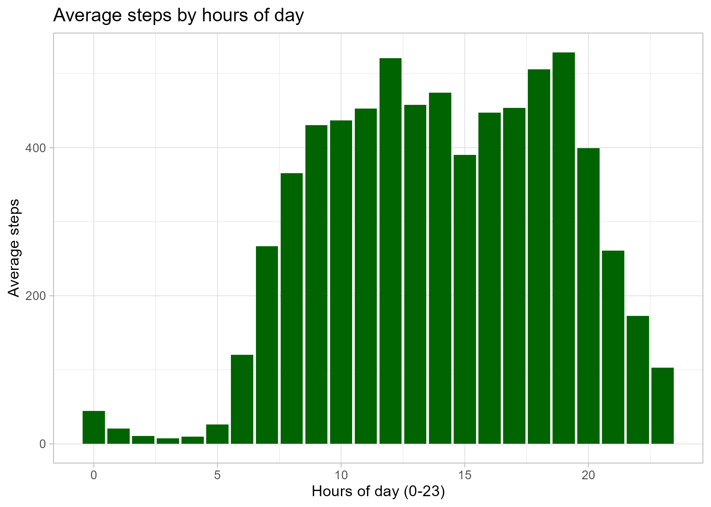
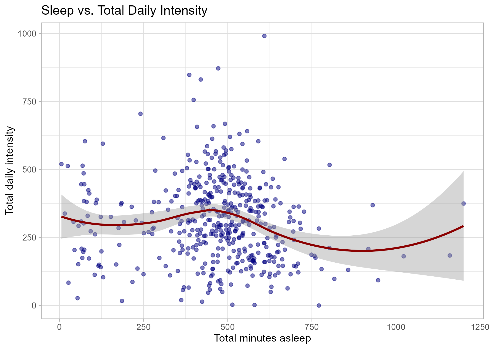
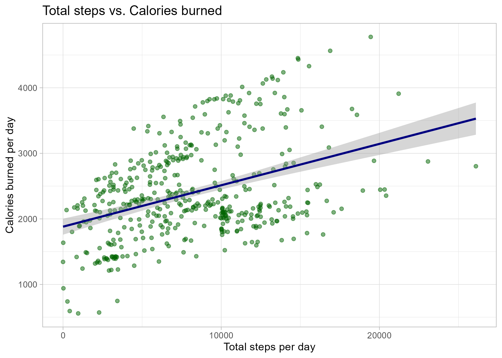

# Bellabeat: Analyze Smart Device Usage for Marketing Strategy

## 📝 Overview
This project was completed as the Capstone for the Google Data Analytics Professional Certificate.

It involves a comprehensive data analysis of fitness tracker data to provide actionable insights for Bellabeat, a high-tech manufacturer of health-focused smart products for women. The goal is to understand consumer usage of smart devices to inform and guide Bellabeat's marketing strategy and unlock new growth opportunities in the global smart device market.

The analysis follows the six steps of the data analysis process: Ask, Prepare, Process, Analyze, Share, and Act.

## 🎯 Business Task
Urška Sršen, co-founder and Chief Creative Officer of Bellabeat, believes that analyzing trends in smart device usage can help the company further develop its marketing strategy. The primary business task is to:

`Analyze publicly available smart device usage data to gain insights into how consumers are currently using their devices, and then provide high-level recommendations to guide Bellabeat's marketing team on how to tailor their marketing strategy for products like the Bellabeat Time smart watch and the Bellabeat Membership service.`

## 📊 Data Source
**Dataset**

The analysis uses the [FitBit Fitness Tracker Data](https://www.kaggle.com/datasets/arashnic/fitbit), a public domain dataset available on Kaggle, sourced from 33 users who consented to the submission of personal tracker data.

**Data Limitations**
* Small Sample Size: Data comes from only 33 users, which may not be representative of the broader population of health-conscious women.

* Time Period: Data was collected over a limited two-month period (March-May 2016) and may not reflect current usage trends.

* Demographic Data: The dataset lacks demographic information (gender, age, location), which limits the ability to create highly targeted marketing campaigns.

* Inconsistent Tracking: Not all users tracked all metrics (e.g., 11 tracked weight).

## 🛠️ Methodology and Tools
The entire data analysis process, from data cleaning to visualization, was performed using RStudio (Packages: tidyverse, ggplot2, dplyr, lubridate):

* Data Cleaning & Manipulation: 	Merging, cleaning, transforming, and calculating summary statistics on various activity and sleep tables.
* Visualization & Reporting: Creating a professional visualization to communicate key findings to stakeholders.
* Initial Data Inspection: Preliminary cleaning and high-level review of the raw CSV files.

More details in [RMarkdown file](https://github.com/Behindpea/bellabeat/blob/main/Bellabeat_RMarkdown.Rmd).

## 💡 Key Findings
The analysis of daily activity, sleep, and intensity habits revealed several key trends:

* Low active: The average user takes around 7,605 steps per day. While active, this is below the commonly cited 10,000-step goal, suggesting there is an opportunity to encourage users to be more active.

* Activity peaks: Users are most active in two primary windows: around 12 PM and the evening 5 PM - 7 PM, likely correlating with post-work exercise.
  
  

* A tiny fraction of users in this dataset (likely 11 out of 33) ever logged their weight. This strongly implies that users dislike or forget to perform manual data entry.

* Longer sleeping doesn’t automatically mean a user will be more active (or vice versa)
  
  

* Correlate between metrics: A strong positive correlation exists between Total Steps and Calories Burned, reinforcing the fundamental value proposition of activity tracking.
  
  
## 📈 Actionable Recommendations
Based on the analysis, the following recommendations are provided to the Bellabeat marketing team:

* **Market “Workday Wellness” reminders**: Bellabeat should create a marketing campaign for the Leaf/Time that focuses on its “inactivity alert” or “mindful moment” features. The Bellabeat app could send push notifications (e.g., at 11 AM and 3 PM) to remind users to take a short walk or stretch. This positions the product as a wellness companion that helps user stay healthy during the workday, not just at the gym.
* **Launch an “Evening Activity” campaign**: This is the golden hour for engagement. Bellabeat’s marketing should target users at this time.
    - App Marketing: Send push notifications around 4:30 PM with messages like, “Your workday is ending! Get your steps in.” or “Join our Bellabeat community challenge at 6 PM.”
    - Social Media: Run ads during this window that encourage an evening walk or workout. This leverages a habit users already have.
 * **Emphasize “Effortless Tracking” in all marketing**: Bellabeat’s marketing should heavily emphasize that its products (Leaf, Time) track activity, sleep, and stress automatically. Use words like “effortless,” “automatic,” and “set it and forget it.” This is a key competitive advantage against apps that require manual logging and directly addresses the user behavior seen in the data. They should de-emphasize features that require a lot of manual input.

## 🧑‍💻 Connect me - Giang Nguyen

[GitHub](https://github.com/Behindpea/) | [LinkedIn](https://www.linkedin.com/in/giangnh217/)
